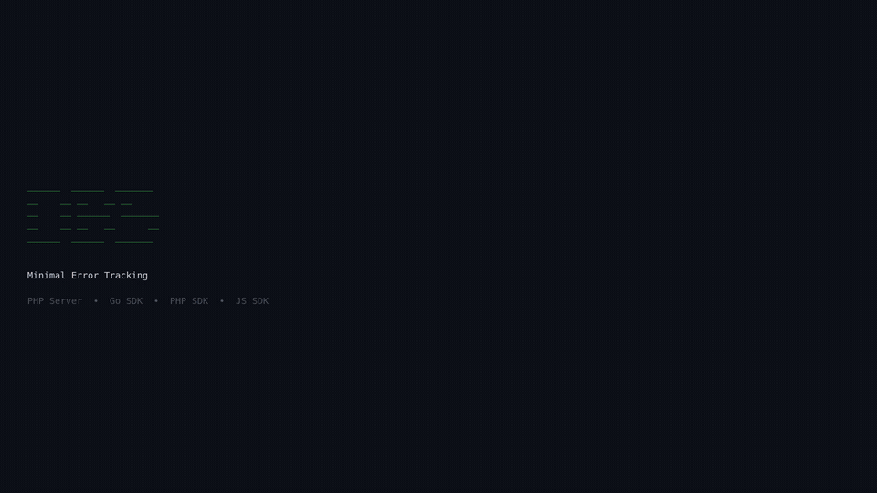

# obs

A minimal, self-hosted error tracking platform. Think Sentry, but simple enough to fit in a single repo.



## Architecture

```
 ┌─────────────────────────────────────────────────────────────────┐
 │                          obs server                             │
 │                         (PHP + SQLite)                          │
 │                                                                 │
 │   POST /api/events ──────────┐     GET / ──────────┐           │
 │   (JSON ingestion)           │     (dashboard)      │           │
 │                              ▼                      ▼           │
 │                     ┌──────────────┐       ┌──────────────┐     │
 │                     │   api.php    │       │  views/*.php │     │
 │                     │  validate    │       │  HTML + CSS  │     │
 │                     │  API key     │       │  dark theme  │     │
 │                     └──────┬───────┘       └──────┬───────┘     │
 │                            │                      │             │
 │                            ▼                      ▼             │
 │                     ┌─────────────────────────────────┐         │
 │                     │         SQLite (obs.sqlite)     │         │
 │                     │         single events table     │         │
 │                     └─────────────────────────────────┘         │
 └─────────────────────────────────────────────────────────────────┘
                 ▲              ▲              ▲
                 │              │              │
            HTTP POST      HTTP POST      HTTP POST
          X-OBS-Key: …    X-OBS-Key: …   X-OBS-Key: …
                 │              │              │
          ┌──────┴──┐    ┌─────┴───┐    ┌─────┴───┐
          │  Go SDK │    │ PHP SDK │    │  JS SDK │
          │         │    │         │    │ bun/node│
          │ capture │    │ capture │    │ browser │
          │ + flush │    │ + flush │    │ + flush │
          └─────────┘    └─────────┘    └─────────┘
```

## Data flow

```
  your app                     obs server                   dashboard
  ────────                     ──────────                   ─────────

  err := doWork()
       │
       ▼
  obs.CaptureException(err)
       │
       │  ┌─────────────────┐
       ├─▶│ capture stack   │
       │  │ build JSON      │
       │  │ buffer event    │
       │  └────────┬────────┘
       │           │
       │     background
       │      goroutine
       │           │
       │           ▼
       │   POST /api/events ─────▶ validate key
       │   {                       parse JSON
       │     message,              store in SQLite ──────▶ GET /
       │     stacktrace,                                  grouped by
       │     level,                                       message
       │     platform                                        │
       │   }                                                 ▼
       │                                              ┌────────────┐
       │                                              │ event list │
       │                                              │ with count │
       │                                              │ and badges │
       │                                              └─────┬──────┘
       │                                                    │
       │                                              click │
       │                                                    ▼
       │                                              ┌────────────┐
       │                                              │   detail   │
       │                                              │ stacktrace │
       │                                              │  metadata  │
       │                                              └────────────┘
       ▼
  obs.Flush(5s)
```

## Quickstart

```sh
# install php via mise (or use your own)
mise use php@latest

# install JS SDK deps
cd sdk/js && bun install && cd ../..

# install PHP SDK deps
cd sdk/php && composer install && cd ../..

# start the server
OBS_API_KEY=test123 php -S localhost:8000 server/index.php
```

Send an event:

```sh
curl -X POST http://localhost:8000/api/events \
  -H "Content-Type: application/json" \
  -H "X-OBS-Key: test123" \
  -d '{"message":"something broke","level":"error","platform":"curl"}'
```

Open http://localhost:8000 to see the dashboard.

## SDKs

### Go

```go
import obs "github.com/alexisbouchez/observability-prototype/sdk/go"

obs.Init(obs.Options{
    DSN:         "http://test123@localhost:8000",
    Environment: "production",
})

obs.CaptureException(err)           // error with stacktrace
obs.CaptureMessage("deploy done")   // info message
defer obs.Recover()                 // catch panics
obs.Flush(5 * time.Second)          // flush before exit
```

### PHP

```php
\Obs\Client::init([
    'dsn'         => 'http://test123@localhost:8000',
    'environment' => 'production',
]);

\Obs\Client::captureException($e);
\Obs\Client::captureMessage('deploy done');
// auto-flushes on shutdown
```

### JavaScript (Bun / Node.js / Browser)

```ts
import * as obs from '@obs/sdk';

obs.init({
  dsn: 'http://test123@localhost:8000',
  environment: 'production',
});

obs.captureException(new Error('broke'));
obs.captureMessage('deploy done');
await obs.flush();
```

## Event schema

```
┌────────────┬──────────┬──────────────────────────────────────┐
│ field      │ type     │ notes                                │
├────────────┼──────────┼──────────────────────────────────────┤
│ id         │ TEXT     │ UUID, primary key                    │
│ level      │ TEXT     │ error / warning / info               │
│ message    │ TEXT     │ required                             │
│ stacktrace │ TEXT     │ JSON array of {filename,function,    │
│            │          │ lineno} frames                       │
│ platform   │ TEXT     │ go / php / javascript / ...          │
│ timestamp  │ DATETIME │ ISO 8601                             │
│ server_name│ TEXT     │ hostname                             │
│ environment│ TEXT     │ production / staging / dev            │
│ extra      │ TEXT     │ arbitrary JSON                       │
└────────────┴──────────┴──────────────────────────────────────┘
```

## Makefile

```sh
make help       # show all targets
make test       # run all SDK tests (Go + PHP + JS)
make demo       # start server, run all examples, check dashboard
make server     # start the PHP server
make stop       # stop the server
make clean      # stop + delete SQLite DB
```

## Project structure

```
obs/
├── server/
│   ├── index.php              # router
│   ├── api.php                # POST /api/events
│   ├── db.php                 # SQLite + auto-migration
│   └── views/
│       ├── layout.php         # HTML shell, dark theme CSS
│       ├── dashboard.php      # event list grouped by message
│       └── event.php          # event detail + stacktrace
├── sdk/
│   ├── go/
│   │   ├── obs.go             # Init, CaptureException, CaptureMessage, Recover, Flush
│   │   └── obs_test.go        # 6 tests
│   ├── php/
│   │   ├── src/Client.php     # static API, buffered transport, auto-flush
│   │   └── tests/ClientTest.php  # 12 tests
│   └── js/
│       ├── src/index.ts       # universal SDK (Bun/Node/Browser)
│       └── test/obs.test.ts   # 15 tests
├── example/
│   ├── main.go                # Go example
│   ├── php/main.php           # PHP example
│   └── js/main.ts             # JS/Bun example
├── demo/
│   └── render.sh              # generates demo.mp4 with ffmpeg
├── Makefile
└── mise.toml
```

## Auth

Single API key via `OBS_API_KEY` environment variable. SDKs pass it in the `X-OBS-Key` header. The DSN format encodes the key as the username: `http://KEY@host:port`.

## License

MIT
